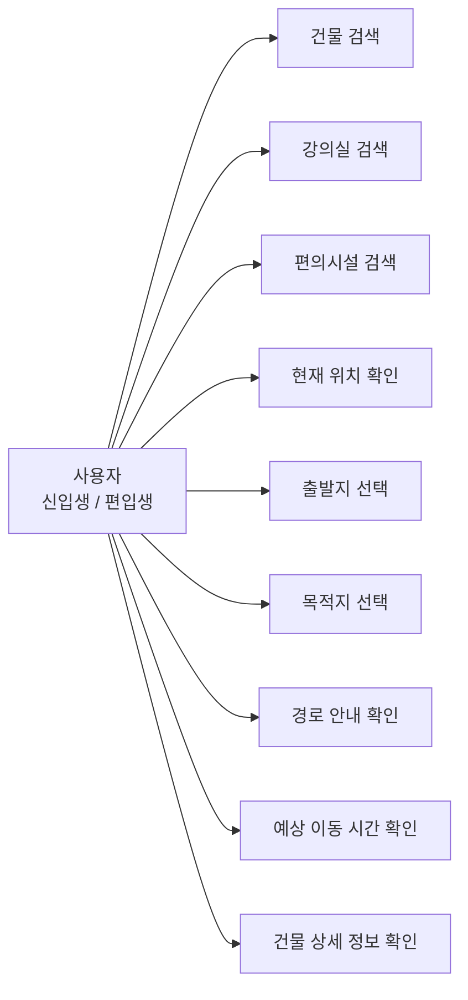
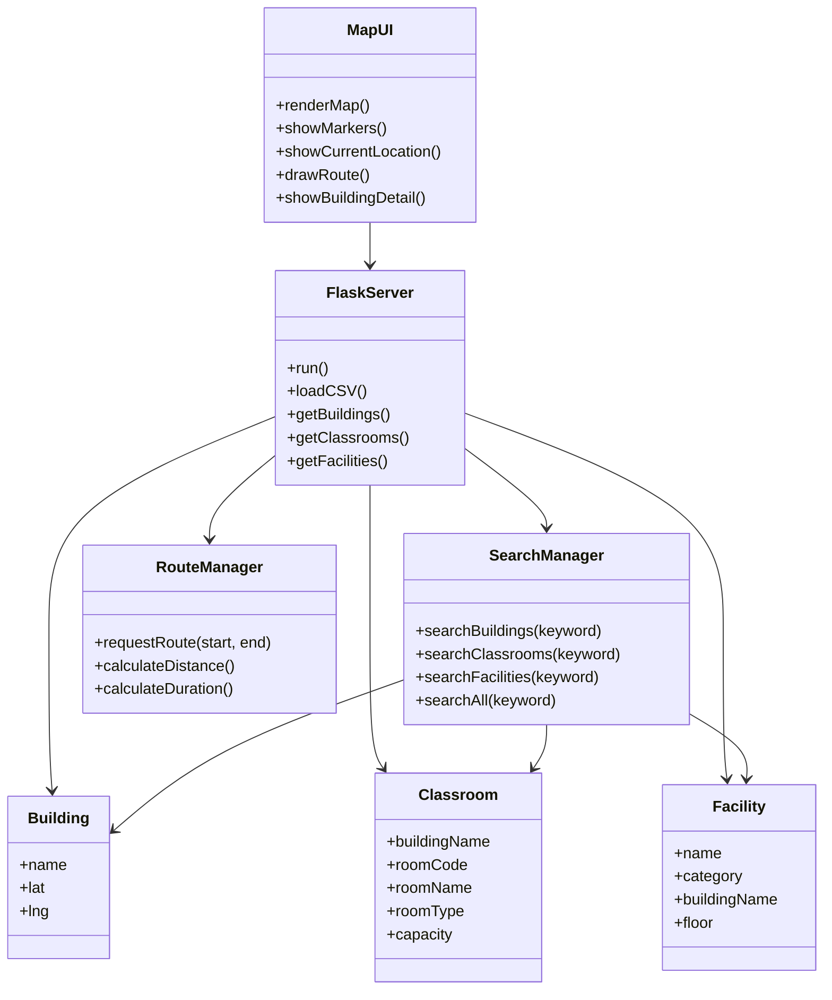
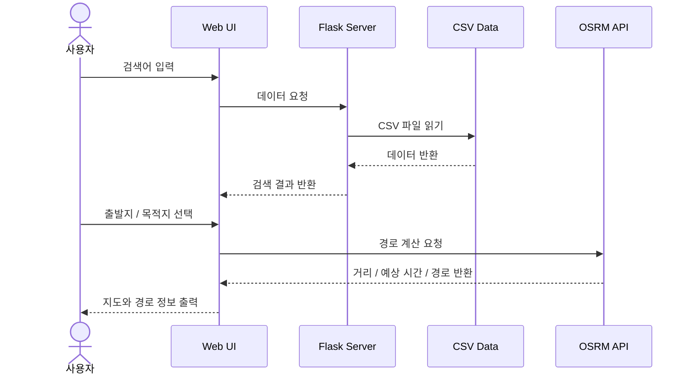
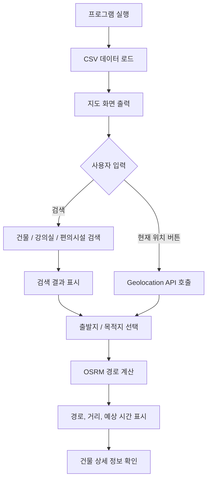
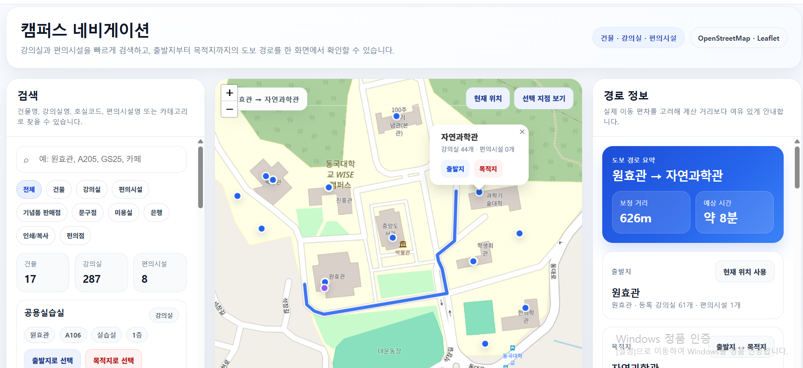

# 캠퍼스 네비게이션 웹 구현 최종 보고서

학번: 2021212829  
이름: 조현민  

---

## 1. 실험의 목적과 범위

### 1.1 목적
본 프로젝트의 목적은 신입생, 편입생과 같이 캠퍼스 지리에 익숙하지 않은 사용자가 건물, 강의실, 편의시설의 위치를 빠르게 찾고, 출발지부터 목적지까지의 이동 경로와 예상 시간을 한 화면에서 확인할 수 있는 웹 기반 캠퍼스 네비게이션 시스템을 구현하는 데 있다.

### 1.2 범위
본 프로젝트는 학교 건물 좌표 데이터와 강의실, 편의시설 데이터를 CSV 파일 형태로 정리하고, 이를 웹에서 검색 및 경로 안내 기능과 연동하는 것을 범위로 한다.

### 1.3 포함 내용
- 건물 검색
- 강의실 검색
- 편의시설 검색
- 출발지 / 목적지 선택
- 건물 상세 정보 확인
- 도보 경로, 거리, 예상 시간 표시
- 현재 위치 기반 안내 기능
- 웹 UI 제공

### 1.4 불포함 내용
- 실내 상세 길찾기
- 층별 실제 이동 경로 안내
- 사용자 로그인 및 개인화 기능
- 데이터베이스 기반 실시간 관리 기능
- 선호 경로 추천 기능

---

## 2. 분석

### 2.1 주요 사용자
- 신입생
- 편입생
- 캠퍼스 지리에 익숙하지 않은 학생

### 2.2 기능 목록
- 건물, 강의실, 편의시설 통합 검색
- 검색 결과에서 출발지 / 목적지 선택
- 지도 위 건물 및 편의시설 마커 표시
- 경로, 거리, 예상 시간 출력
- 현재 위치 표시
- 건물 상세 정보에서 내부 강의실 및 편의시설 확인

### 2.3 유스케이스 다이어그램



### 2.4 기능 명세서

| 기능명 | 입력 | 처리 | 출력 |
|---|---|---|---|
| 건물 검색 | 건물명 | 건물 데이터 비교 | 건물 목록 및 지도 위치 |
| 강의실 검색 | 강의실명, 호실코드 | 강의실 데이터 비교 | 강의실 검색 결과 |
| 편의시설 검색 | 시설명, 카테고리 | 편의시설 데이터 비교 | 시설 검색 결과 |
| 출발지 / 목적지 선택 | 검색 결과 또는 지도 클릭 | 선택 정보 저장 | 경로 계산 준비 |
| 경로 안내 | 출발지, 목적지 좌표 | OSRM 기반 경로 계산 | 지도 경로, 거리, 예상 시간 |
| 현재 위치 표시 | 브라우저 위치 권한 | Geolocation API 사용 | 현재 위치 마커 |
| 건물 상세 정보 확인 | 건물 선택 | 건물, 강의실, 편의시설 데이터 연결 | 상세 정보 패널 |

---

## 3. 설계

### 3.1 전체 구조 설계
시스템은 Flask를 사용하는 백엔드와 HTML/CSS/JavaScript 기반 프론트엔드로 구성하였다.  
백엔드는 CSV 파일을 읽어 API 형태로 데이터를 제공하고, 프론트엔드는 이를 받아 검색 기능, 지도 표시, 경로 탐색 기능을 수행한다.

### 3.2 클래스 다이어그램
아래 클래스 다이어그램은 실제 구현 코드를 그대로 옮긴 것이 아니라, 시스템의 주요 데이터와 기능 역할을 설계 관점에서 단순화하여 표현한 것이다.



### 3.3 순서 다이어그램



### 3.4 순서도



### 3.5 의사코드

```text
1. 사용자가 검색어를 입력한다.
2. 건물 데이터에서 검색어가 포함된 항목을 찾는다.
3. 강의실 데이터에서 검색어가 포함된 항목을 찾는다.
4. 편의시설 데이터에서 검색어가 포함된 항목을 찾는다.
5. 검색 결과를 하나의 목록으로 정리하여 화면에 출력한다.
6. 사용자가 출발지와 목적지를 선택하면 각 좌표를 가져온다.
7. OSRM API에 좌표를 전달하여 도보 경로를 요청한다.
8. 반환된 거리와 시간을 화면에 표시한다.
9. 현재 위치 버튼을 누르면 Geolocation API를 통해 현재 좌표를 받아 지도에 표시한다.
```

---

## 4. 구현

### 4.1 구현 환경
- 운영 환경: Windows
- 개발 도구: Visual Studio Code
- 실행 환경: Python, 웹 브라우저

### 4.2 사용 기술
- 백엔드: Python, Flask
- 프론트엔드: HTML, CSS, JavaScript
- 지도 라이브러리: Leaflet
- 지도 데이터: OpenStreetMap
- 경로 계산: OSRM
- 현재 위치 기능: Geolocation API
- 데이터 저장 방식: CSV 파일

### 4.3 서버 / 클라이언트 구조
- `app.py`가 Flask 서버 역할을 수행한다.
- `classroom_data.csv`, `building_coords.csv`, `facilities.csv`를 읽어 데이터 API를 제공한다.
- `index.html`, `style.css`, `script.js`가 화면 구성과 동작을 담당한다.
- 클라이언트는 API 응답을 받아 검색, 마커 표시, 경로 탐색을 수행한다.

### 4.4 구현 화면

#### (1) 메인 화면
- 검색 패널, 지도, 경로 정보 패널이 한 화면에 배치되도록 구성하였다.
- 전체 / 건물 / 강의실 / 편의시설 필터 버튼을 통해 원하는 결과를 빠르게 확인할 수 있다.



#### (2) 편의시설 검색 화면
- 편의점, 카페, 문구점 등 편의시설도 검색 가능하도록 구현하였다.
- 예시 화면에서는 `GS` 검색 시 편의시설 결과가 정상적으로 표시된다.


#### (3) 건물 상세 정보 화면
- 건물을 선택하면 해당 건물의 강의실 수, 편의시설 수, 좌표 정보를 확인할 수 있다.
- 내부 편의시설 및 강의실 목록도 함께 표시되도록 구성하였다.


---

## 5. 실험

### 5.1 테스트 데이터
- 건물 데이터: 17개
- 강의실 데이터: 287개
- 편의시설 데이터: 8개

### 5.2 테스트 항목 및 결과

| 테스트 항목 | 입력 예시 | 기대 결과 | 실제 결과 |
|---|---|---|---|
| 건물 검색 | 원효관 | 건물 검색 결과 표시 | 정상 동작 |
| 강의실 검색 | A106, S501 | 강의실 검색 결과 표시 | 정상 동작 |
| 편의시설 검색 | GS, 편의점 | 편의시설 검색 결과 표시 | 정상 동작 |
| 경로 탐색 | 원효관 → 자연과학관 | 지도 경로 및 예상 시간 표시 | 정상 동작 |
| 건물 상세 정보 | 원효관 클릭 | 강의실 및 편의시설 정보 표시 | 정상 동작 |
| 현재 위치 기능 | 현재 위치 버튼 클릭 | 사용자 위치 표시 | 동작하나 일부 오차 가능 |

### 5.3 실험 결과 분석
실험 결과, 건물, 강의실, 편의시설의 통합 검색 기능이 정상적으로 동작하였고, 출발지와 목적지 선택 후 지도에 경로와 예상 시간이 표시되는 것을 확인하였다. 또한 건물 상세 정보에서 내부 강의실 및 편의시설 목록이 정상적으로 출력되었다.

현재 위치 기능은 브라우저의 Geolocation API를 이용하여 구현하였으며, 실내 환경이나 PC 환경에서는 Wi-Fi 및 네트워크 기반 위치 추정이 사용될 수 있어 실제 위치와 약간의 오차가 발생할 수 있음을 확인하였다.

---

## 6. 결론

본 프로젝트에서는 건물과 강의실 중심의 캠퍼스 탐색 기능을 구현한 후, 편의시설 검색 기능과 UI 개선을 추가하여 보다 실제 서비스에 가까운 캠퍼스 네비게이션 웹을 완성하였다.  
사용자는 건물, 강의실, 편의시설을 통합 검색할 수 있고, 출발지와 목적지를 설정하여 도보 경로와 예상 이동 시간을 확인할 수 있으며, 현재 위치 기반 안내도 사용할 수 있다.

### 6.1 아쉬운 점
- 현재 경로 안내는 최단 거리 중심으로 구현되어 있다.
- 실내 상세 길찾기와 층별 동선까지는 반영하지 못하였다.
- 현재 위치 기능은 사용 환경에 따라 오차가 발생할 수 있다.

### 6.2 개선 가능성
- 학생 및 교직원의 실제 이동 데이터를 반영하여 선호 경로 기반 안내로 확장 가능하다.
- 실내 좌표 데이터가 확보되면 층별 상세 안내 기능으로 발전시킬 수 있다.
- 모바일 환경 최적화를 통해 실제 활용성을 더욱 높일 수 있다.

---

## 7. 저장소 구성 예시

```text
campus-navigation
├─ app.py
├─ classroom_data.csv
├─ building_coords.csv
├─ facilities.csv
├─ README.md
├─ campus_navigation_final_report.md
├─ templates
│  └─ index.html
└─ static
   ├─ style.css
   └─ script.js
```


